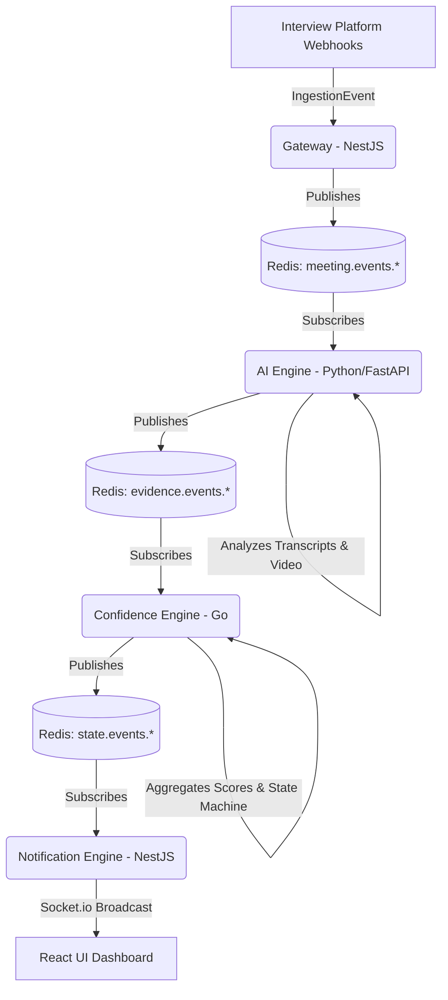

# Sherlock Continuous Identity Engine (CIE)

Welcome to **Sherlock CIE**, an advanced, event-driven microservices architecture designed to continuously authenticate candidate identities during high-stakes remote interviews. 

By analyzing metadata, behavioral biometrics, and conversational transcripts in real-time, Sherlock guarantees zero-trust remote assessments.

### Getting Started (Local Windows Environment)

Since the original architecture relied on Docker and Go which may be unavailable on some Windows systems, we provide a native shim setup.

1. **Install Redis natively for Windows:** Download the pre-compiled `redis-server.exe` (v5.0.14.1) and run it on port `6379`.
2. **Install dependencies:** `pnpm install` at the root.
3. **Start the Web UI:** `cd apps/web && pnpm run dev` (Runs on port `3000`)
4. **Start the Gateway:** `cd apps/gateway && pnpm run dev` (Runs on port `3001`)
5. **Start the Notification Engine:** `cd apps/notification && pnpm run start:dev` (Runs on port `3002`)
6. **Start the AI Engine:** `cd apps/ai-engine && .venv\Scripts\python.exe -m uvicorn main:app --port 8000`
7. **Start the Confidence Engine Shim:** `pnpm run start:confidence` from the root directory.

To run the end-to-end simulation script:
```bash
pnpm run test:e2e
```

---

## 🏗 System Architecture

Sherlock CIE leverages an event-driven pub/sub architecture built around Redis. 



### Core Components
1. **Gateway (`apps/gateway`)**: A NestJS edge proxy that ingests provider webhooks, sanitizes them via strict Zod contracts, and streams them onto Redis.
2. **AI Engine (`apps/ai-engine`)**: A Python/FastAPI worker utilizing `google-genai` and deterministic heuristics to evaluate conversational coherence and metadata anomalies.
3. **Confidence Engine (`apps/confidence-engine`)**: A highly concurrent Go microservice that aggregates evidence scores and executes a thread-safe state machine to transition candidate confidence (e.g., `PENDING` -> `SUSPICIOUS`).
4. **Notification Engine (`apps/notification`)**: A NestJS Socket.io server that bridges backend Redis events to connected browser clients.
5. **Web Dashboard (`apps/web`)**: A Next.js/Tailwind frontend visualizing real-time identity states.

### Shared Libraries
- `@sherlock/contracts`: Single source of truth for Zod schemas defining cross-boundary events.
- `@sherlock/redis-client`: Singleton Redis connection pool.
- `@sherlock/database`: Prisma 7 ORM schemas (Postgres).

---

## 🚀 Local Development Setup

### Prerequisites
- Node.js (v20+)
- pnpm
- Python (3.11+)
- Go (1.21+)
- Docker (for Redis and Postgres)

### 1. Start Infrastructure
Run the core caching and database layers.
```bash
docker-compose up -d
```

### 2. Install Dependencies
```bash
pnpm install
```

### 3. Start the Ecosystem
You must boot the services in individual terminals:
- **NestJS Gateway**: `cd apps/gateway && pnpm run start:dev`
- **Python AI Engine**: `cd apps/ai-engine && python main.py`
- **Go Confidence Engine**: `cd apps/confidence-engine && go run main.go`
- **Notification Server**: `cd apps/notification && pnpm run start:dev`
- **React Dashboard**: `cd apps/web && pnpm run dev`

### 4. Run the Mock Simulation
To test the entire pipeline locally without joining a real video call, execute the End-to-End Mock script. This simulates a suspicious candidate turning off their camera and speaking nervously.
```bash
pnpm run test:e2e
```
*Watch the React Dashboard turn RED (`FAILED` / `SUSPICIOUS`) in real-time!*

---

## 🛡️ Engineering Principles

1. **Zero-Trust Boundaries**: Every service parses incoming payloads against strict Zod/Pydantic schemas. 
2. **Polyglot Optimization**: The right tool for the right job (Python for AI, Go for concurrent state management, Node/React for IO/Web).
3. **Horizontal Scalability**: The Pub/Sub decoupled architecture allows any engine to scale horizontally without blocking upstream ingestion.
