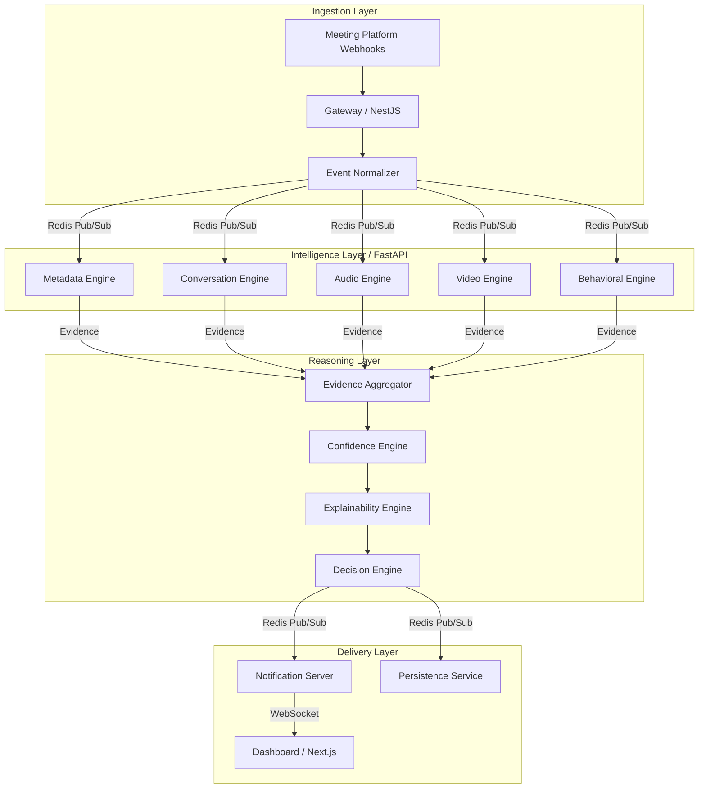

# Sherlock CIE — Candidate Identity Engine

> **Real-time, AI-powered candidate identification for live video interviews.**

Sherlock CIE is a production-grade microservices system that continuously identifies which meeting participant is the interview candidate during a live video interview. It combines multiple weak signals—metadata, audio, video, transcript, and behavioral analysis—into a confidence-weighted decision with full explainability.

---

## Architecture



### Core Principle

> **Evidence-first reasoning.** No single signal makes the decision. Every intelligence engine produces independently weighted evidence. The Confidence Engine aggregates all evidence with temporal decay and Bayesian updating. The Decision Engine applies configurable thresholds with hysteresis to prevent oscillation. The Explainability Engine generates human-readable justifications for every determination.

---

## Tech Stack

| Layer         | Technology                                   |
| ------------- | -------------------------------------------- |
| Frontend      | Next.js 15, React 19, TailwindCSS, shadcn/ui |
| Gateway       | NestJS, TypeScript                           |
| AI Engine     | FastAPI, Python 3.12                         |
| Reasoning     | TypeScript (Go-ready architecture)           |
| Notification  | NestJS, Socket.io                            |
| Database      | PostgreSQL 16, Prisma ORM                    |
| Cache/Pub-Sub | Redis 7                                      |
| LLM           | Gemini 2.5 Pro                               |
| Contracts     | Zod (TS) / Pydantic (Python)                 |
| Monorepo      | Turborepo, pnpm                              |
| Deployment    | Docker, Vercel, Railway                      |

---

## Quick Start

### Prerequisites

- Node.js 20+
- pnpm 9+
- Python 3.12+
- Docker & Docker Compose

### Setup

```bash
# Clone
git clone https://github.com/vaishak-v-nair/sherlock.git
cd sherlock

# Install dependencies
pnpm install

# Copy environment variables
cp .env.example .env

# Start infrastructure
docker compose up -d postgres redis

# Setup Python AI engine
cd apps/ai-engine
python -m venv .venv
.venv/Scripts/pip install -r requirements.txt  # Windows
# source .venv/bin/activate && pip install -r requirements.txt  # macOS/Linux
cd ../..

# Apply database migrations
pnpm db:push

# Start all services
pnpm dev
```

### Run the Simulation

```bash
# In a new terminal, trigger the E2E mock simulation
pnpm test:e2e
```

Open `http://localhost:3000` to watch the dashboard update in real-time.

---

## Project Structure

```
sherlock/
├── apps/
│   ├── web/              # Next.js 15 frontend dashboard
│   ├── gateway/          # NestJS webhook ingestion service
│   ├── notification/     # NestJS WebSocket notification server
│   └── ai-engine/        # FastAPI intelligence engines (Python)
├── packages/
│   ├── contracts/        # Shared Zod event schemas
│   ├── database/         # Prisma schema and migrations
│   ├── redis-client/     # Shared Redis connection factory
│   ├── eslint-config/    # Shared ESLint configuration
│   └── tsconfig/         # Shared TypeScript configurations
├── docker/               # Dockerfiles for each service
├── docs/                 # Engineering documentation
│   ├── TECHNICAL_DESIGN.md
│   ├── ENGINEERING_RULEBOOK.md
│   ├── CODING_STANDARDS.md
│   ├── DEVELOPMENT_WORKFLOW.md
│   ├── SPRINT_PLAN.md
│   ├── PROJECT_CHECKLIST.md
│   └── IMPLEMENTATION_ORDER.md
└── scripts/              # E2E simulation and utilities
```

---

## How It Works

1. **Webhook arrives** from a meeting platform (Zoom, Meet, Teams)
2. **Gateway validates** the payload against strict Zod schemas and publishes to Redis
3. **Intelligence engines** independently analyze the event:
   - **Metadata Engine** — fuzzy name matching, join order analysis
   - **Conversation Engine** — LLM-powered transcript role classification
   - **Audio Engine** — speaking duration and pattern analysis
   - **Video Engine** — webcam state and face analysis
   - **Behavioral Engine** — interaction pattern analysis
4. Each engine produces **weighted evidence** with a score, confidence, and explanation
5. **Evidence Aggregator** collects all evidence with temporal decay weighting
6. **Confidence Engine** computes per-participant confidence scores using Bayesian updating
7. **Decision Engine** transitions session state: `PENDING → TENTATIVE → IDENTIFIED → CONFIRMED`
8. **Notification Server** broadcasts state updates via WebSocket to the dashboard
9. **Dashboard** renders real-time participant cards, confidence graphs, and explanations

---

## Assumptions

See [docs/assumptions.md](docs/assumptions.md) for a complete list of design assumptions.

Key assumptions:

- The system receives webhook events from a meeting bot (not implemented in this prototype)
- Audio/video analysis uses heuristics; production would use ML models
- LLM analysis requires a Gemini API key
- The prototype uses simulated events via `pnpm test:e2e`

---

## Evaluation

See [docs/evaluation_metrics.md](docs/evaluation_metrics.md) for metrics, edge cases, and limitations.

---

## License

MIT — see [LICENSE](LICENSE).
